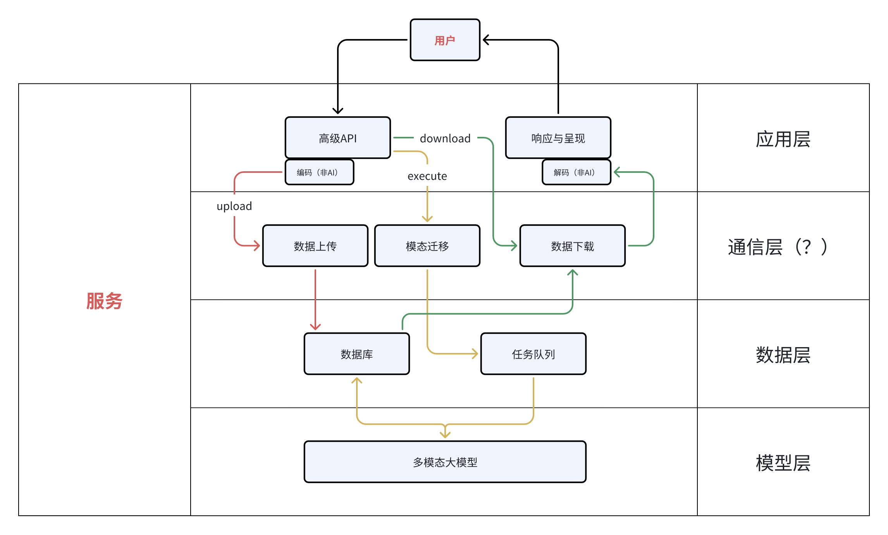

# TEAM
TEAM: a Toolkit for Evaluating and Aligning Multimodal large models.

## 项目结构

+ /app/：前后端部分。即框架应用层。
  + /service/：前端，包括i18n和静态文件。
  + api.py：建议后端，仅接收post请求的api服务，待后台大模型通信完善后补全。
+ /base/：各种基类和数据结构的存放。
  + model.py：所有模型的基类。
+ /data/：框架的数据层，负责数据存储（初步取消存储）与任务调度。初步计划为使用base64进行数据传输。
+ /models/：框架的模型层。
  + random_models.py：随机模型，根据prompt随机输出，仅用于测试。
  + m2ugen.py：M2UGen模型的交互器，需要手动部署和暴露api。
  + stable_diffusion.py：SD模型的交互器。目前实现的是与部署好的stable diffusion webui进行交互，用二级api来节省设计成本。
+ main.py：主入口。
